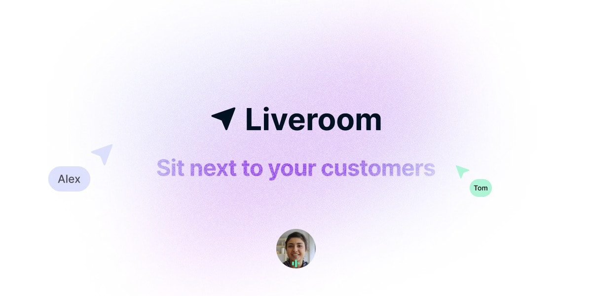

<p align="center">
  <a href="https://liveroom.app">
    
  </a>
</p>

<p align="center">
  <a href="https://liveroom.app">liveroom.app</a>
</p>

<p align="center">
  <a href="https://github.com/liveroom-app/liveroom/actions/workflows/CI.yml?query=branch%3Amain" class="m-1 d-inline-block"></a>
  <!-- <a href="https://www.jsdelivr.com/package/npm/liveroom" class="m-1 d-inline-block"></a> -->
  <a href="https://github.com/liveroom-app/liveroom/issues" class="m-1 d-inline-block"></a>
  <a href="https://github.com/liveroom-app/liveroom" class="m-1 d-inline-block"></a>
</p>

# Liveroom

Liveroom allows you to collaborate with your users, right inside your product.

> [!IMPORTANT]
> Liveroom is currently very early stage.
> We are exploring technical feasibility, and trying different ideas to find what could be a good first version of Liveroom.

> If you are interested in **beta testing the product** once it is ready, please **[join the waitlist](https://tally.so/r/wQ1EvX)**.

## Demo

### on Google Meet

With the Liveroom Chrome Extension, collaborate with your user inside your product with real-time cursors over Google Meet screensharing.

Simply screenshare your tab on the fake product https://mysaas.fly.dev using the `_liveroom` query param with your current Google Meet url:

https://mysaas.fly.dev/?_liveroom=https://meet.google.com/aaa-bbb-ccc

### on [liveroom.app](https://liveroom.app)

The landing page has an interactive dashboard to play with. Open 2 browser windows to see the collaborative features in real-time.

### on your own website

> [!WARNING]
> Liveroom is **NOT production ready**, please don't deploy it yet. This is only for tests purposes.

1. load the **Liveroom Client script** in your HTML header:

```html
<script
  type="module"
  src="https://cdn.jsdelivr.net/npm/liveroom-client-element@0.0.14"
  data-url="wss://liveroom.app/client_socket"
></script>
```

2. open your app on any page adding the `_liveroom` query param:

```
http://localhost:3000/my-super-app/?_liveroom=my_room
```

3. open https://liveroom.app/room/my_room/admin in a second browser window.

> See [examples/simple_html_document.html](examples/simple_html_document.html) as an example.

### on any website

1. run the following code in the browser console to install the **Liveroom Client**:

```js
const script = document.createElement("script");
script.type = "module";
script.src = "https://cdn.jsdelivr.net/npm/liveroom-client-element@0.0.14";

script.setAttribute("data-url", "wss://liveroom.app/client_socket");
script.setAttribute("data-roomid", "my_room");

document.head.appendChild(script);
```

2. open https://liveroom.app/room/my_room/admin in a second browser window.

> This is a quick and dirty solution to test Liveroom.
> It only works on the current loaded web page.
> It may fail if the current website is blocking external scripts.

## Links

- [Context](docs/CONTEXT.md)
- [Contributing](docs/CONTRIBUTING.md)
- [Architecture](docs/ARCHITECTURE.md)
