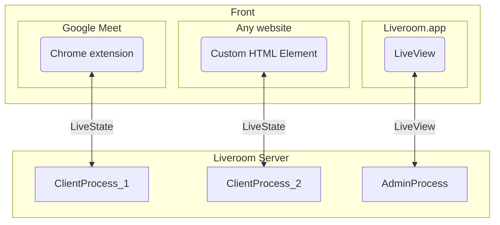

# Architecture

> [!IMPORTANT]  
> This is a work in progress.

**ClientProcess** & **AdminProcess** communicate with each other over PubSub (can't draw it properly on the Mermaid graph), on a particular **room** (topic).

The HTML Custom Element allows Liveroom to be plug-and-play on any SaaS product easily.
